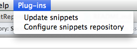
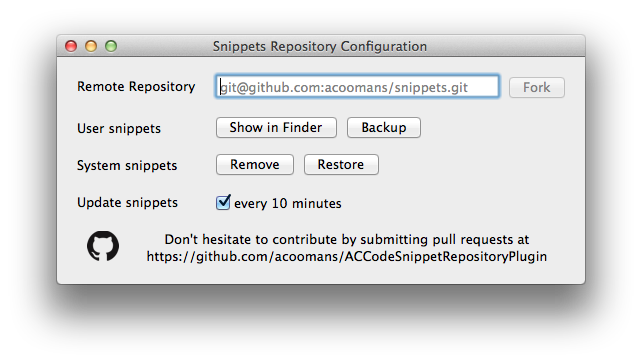
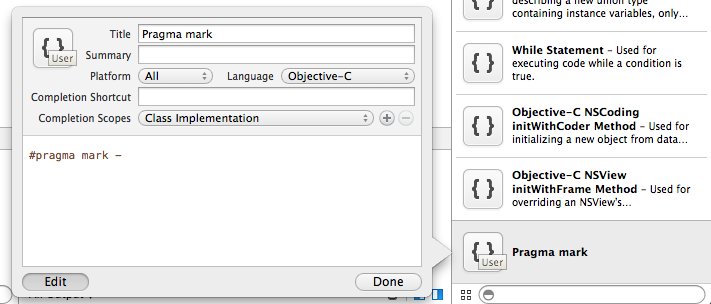
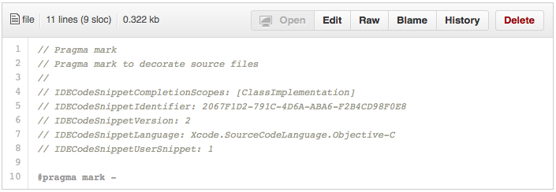
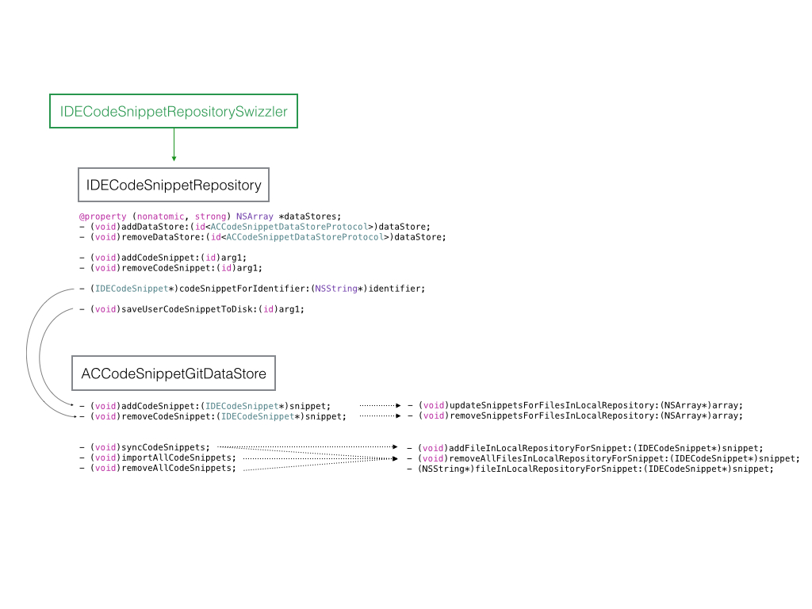

# ACCodeSnippetRepositoryPlugin

ACCodeSnippetRepositoryPlugin is a Xcode plugin for seemless synchronization of snippets with a git repository.

The snippets are synchronized as human-readable text (and not an obscure _.codesnippet_ plist).

If you want to know more about snippets in Xcode, I recommend reading [Xcode Snippets on NSHipster](http://nshipster.com/xcode-snippets/).

Want to try the plugin with an existing public repository? Try [acoomans](https://github.com/acoomans/xcode-snippets) or [mattt](https://github.com/mattt/Xcode-Snippets.git)'s snippets.

## Install

1. Build the project to install the plugin. The plugin is installed in `/Library/Application Support/Developer/Shared/Xcode/Plug-ins/ACCodeSnippetRepository.xcplugin`.

2. Restart Xcode for the plugin to be activated.

## Configuration

There should be a `Plug-ins` item in the xcode menu:

First configure the plugin by forking a remote repository:

When you fork, all snippets from the repository (with the right format, see below _Format_) will be imported in Xcode. Your existing snippets, that do not belong to any repository yet, will not be affected.

After forking, you will given the choice to import (user) snippets from Xcode to the repository.

Also, you can remove the system snippets if you don't use them.

In case of any problem (see below, _Bugs and limitations_), you can go to the user snippets folder and backup your user snippets. Note that user snippets are automatically backed up before any fork.

## Usage

Use snippets like you always do in Xcode. Snippets are automatically added/edited/removed and pushed to the git repository.

### Format 

The snippets are text files with a _.m_ file extension, in the following format:

* a header, containing:
	* the title
	* description
	* various Xcode-related information in a _Key: Value_ format (keys ordered alphabetically)
* the code

If your snippet does not contain any header, the header will be added, committed and pushed when imported.

**Note**: do not remove the Xcode-related information as they are needed for synchronization.

**Note**: if you manually create a snippet by copying an existing one, change or remove the _IDECodeSnippetIdentifier_ as Xcode does not like having two snippets with the same identifier (will crash).

### Synchronization

Every change in a snippet is commited and pushed independently.

Snippets are synchronized (pulled) with the remote repository is done every 10 minutes (if the option is enabled) or when the `Update snippets` item was chosen in the menu.

In case of conflict during the merge, the remote repository has priority.

## Bugs and limitations

Probably a lot. 

Backup your snippets and your git repository. Expect bugs, crashes, synchronization issues, data and hair loss.

## Contributing

### Architecture

First a quick word on the architecture:

The plugin does some swizzling with the _IDECodeSnippetRepository_ class from _IDECodeSnippetLibrary.ideplugin_ (_/Applications/Xcode.app/Contents/PlugIns/IDECodeSnippetLibrary.ideplugin_).

_IDECodeSnippetRepository_ is modified so to make it possible to attach data stores (_ACCodeSnippetDataStoreProtocol_).

Here's a colourful schematic to make you even more confused:

### Pull requests

If you want to contribute, send me a pull request.

### Improvements

Ideas of improvements:

- synchronize _.codesnippet_ plists
- multiple data stores (in progress but need to be careful when synchronizing)
- github's gist support